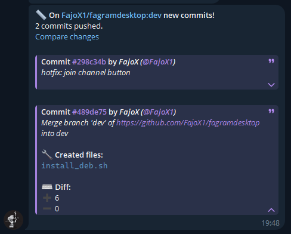
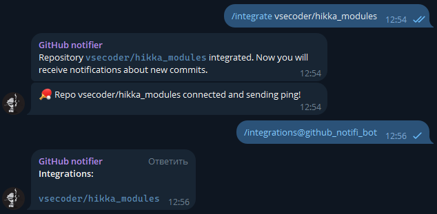

# github-notifi-bot

## Description

This is a simple bot that will notify you when a new issue, commits, stars, etc. are made on a repository. It is written in Python and uses the Github API.

Based on webhooks logic.

## Screenshots

Action messages example

---

List of repositories integrated with the bot in chat

## TODO

- [ ] Add more actions (e.g. issue comments, etc.)
- [ ] Add chat events settings (e.g. enable/disable events)
- [ ] Add stats admin command