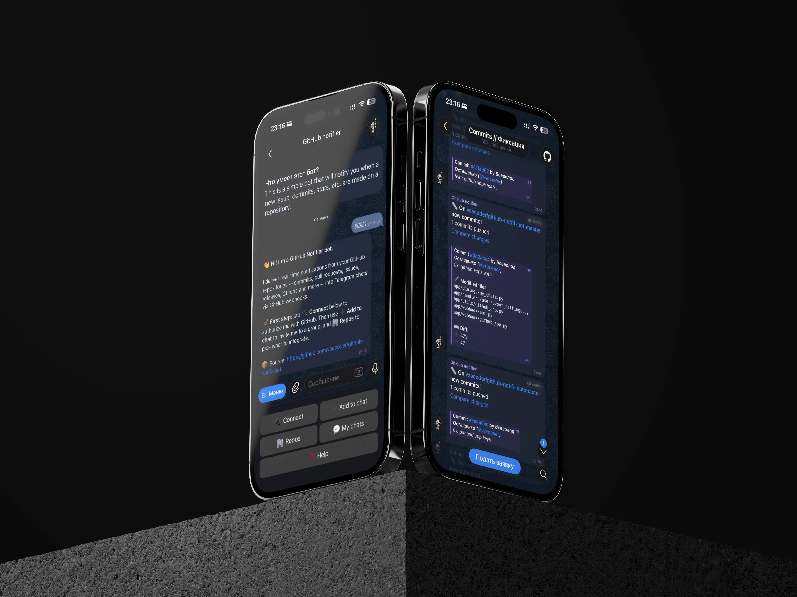
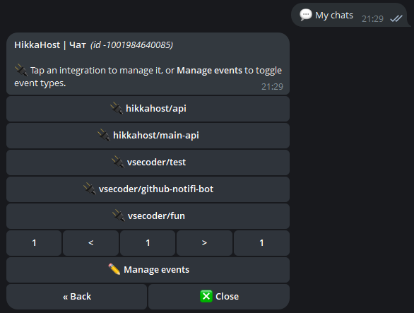
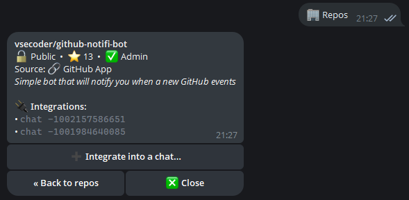

# github-notifi-bot



Telegram bot that delivers real-time notifications about your GitHub repositories
(commits, pull requests, issues, releases, CI runs, stars, forks and more) to
group chats — through GitHub webhooks. Authentication via either a GitHub App
(recommended) or a personal access token; both modes coexist per-user and
per-integration. Written in Python on top of aiogram 3 + aiogram-dialog,
FastAPI and Tortoise-ORM.

## Screenshots






## Features

- 🔔 **Real-time notifications** for 18 GitHub event types (see the table
  below) delivered as Telegram-HTML messages.
- 🔗 **GitHub App authentication** (recommended) — one-click install through
  GitHub's UI, granular per-repo access, auto-rotating installation tokens
  (~1 hour TTL), HMAC-verified App-level webhook. Coexists with PAT — users
  can use either or both. Each `Integration` row records its `auth_source`.
- 🔑 **Personal Access Token** path (legacy) — per-user PAT, per-repo webhook
  via PyGithub. Still works, still supported.
- 💬 **DM-first UX with aiogram-dialog** — persistent reply keyboard
  (`🔌 Connect`, `🏢 Repos`, `💬 My chats`, `➕ Add to chat`, `❓ Help`) plus
  three multi-window dialogs (token, repos browser, my-chats browser) with
  typed Pydantic-backed dialog state.
- 🏢 **Repos browser** — paginated list of orgs/accounts (App + PAT merged),
  drill into repos, "Integrate to a chat…" picker that re-checks admin rights
  and dispatches to the right code path (App vs PAT). No copy-pasting commands.
- 💬 **My chats** — see all chats where you have integrations, manage each
  integration (delete, view auth source) and toggle event types **without
  leaving DM**.
- 🧰 **Per-chat event toggles** via `/events` — enable/disable each event type
  independently. Same UI also accessible from `/integrations` and from the
  My-chats DM dialog.
- 🔄 **`/reinstall`** — re-syncs the GitHub-side webhook subscription list
  with the bot's current capabilities. Stale events are flagged in the
  `/events` keyboard with ⚠️ and blocked from being enabled until reinstall.
- 🧵 **Forum topic delivery** — `/set_topic` records the active forum topic
  and notifications are routed there. Falls back to General if the topic is
  closed; if a topic is permanently deleted, the bot auto-clears it from the
  chat record so future events go straight to General.
- 👥 **Admin-gated everywhere** — only chat administrators can integrate,
  delete, set topic, change events or reinstall (re-checked at action time,
  not just at menu render).
- 🛡 **Structured GitHub error handling** — distinct user-friendly messages
  for invalid/expired token, missing scopes, no admin access, repo not found,
  hook already exists, etc. (no more raw stack traces in the chat).
- ⚠️ **Delivery-failure DM** — when the bot can't deliver to a chat (kicked,
  chat deleted, etc.) the integration owner gets a DM with the cause.
  Rate-limited per `(user, chat)` to 30 minutes so a dead chat doesn't spam
  the owner.
- 🌟 **Star anti-flood** — per-chat configurable cooldown so a viral repo
  doesn't spam the chat.
- 📦 **Pluggable event architecture** — each event type lives in
  [`app/events/`](app/events) as a single file with a Pydantic schema and a
  formatter, and self-registers on import. Adding a new event is one new file.
- 🔌 **Async webhook delivery** — Telegram calls go through `aiohttp`; the
  webhook auto-retries without `message_thread_id` if the topic is gone, and
  classifies 403 (kicked) separately in logs. Both endpoints
  (`/webhook/{token}` for PAT, `/webhook` with HMAC for App) report
  diagnostic JSON (`matched`/`sent`/`skipped` counts).

## Supported events

| Event | What triggers it | Notes |
|-------|------------------|-------|
| `ping` | Webhook installation | Auto-fired by GitHub once on hook creation |
| `push` | Commits pushed to a branch | Per-commit file diff stats fetched via the user's token |
| `issues` | Issue lifecycle | Filtered to `opened`, `closed`, `reopened`, `assigned` |
| `issue_comment` | Comments on issues *and* PRs | Filtered to `created`; PR comments are labelled accordingly |
| `pull_request` | PR lifecycle | Filtered to `opened`, `closed`, `reopened`, `ready_for_review`; "merged" rendered with 🟣 |
| `pull_request_review` | Review submitted on a PR | Filtered to `submitted`; icon by review state (✅/🔴/💬/⚪) |
| `pull_request_review_comment` | Inline comment on a PR diff | Filtered to `created`; shows file path |
| `commit_comment` | Comment on a specific commit | Filtered to `created` |
| `star` | Repo starred / unstarred | Anti-flood applies per chat |
| `fork` | Repo forked | Shows total forks count |
| `create` | Branch or tag created | |
| `delete` | Branch or tag deleted | |
| `release` | Release created/published | Filtered to `published`; drafts skipped; prerelease label shown |
| `workflow_run` | GitHub Actions run finished | Filtered to `completed`; icon by conclusion |
| `discussion` | GitHub Discussions lifecycle | Filtered to `created`, `closed`, `reopened`, `answered` |
| `discussion_comment` | Comment on a discussion | Filtered to `created` |
| `deployment_status` | Deployment status transitions | All states; icon by state |
| `member` | Collaborator added | Filtered to `added` |
| `public` | Repo turned public | |

## Project layout

```
app/
├── __main__.py                  # entry point (bot polling + webhook server)
├── arguments.py                 # CLI args
├── commands.py                  # Telegram bot command menu
├── config.py                    # Pydantic-validated TOML config
│
├── db/
│   ├── models.py                # Tortoise models + EventType / AuthSource enums
│   │                            # (User, Chat, Integration, Installation, Eventsetting)
│   └── functions.py             # Query helpers / domain methods
│
├── events/                      # One file per event: Pydantic schema + formatter
│   ├── _base.py                 # Shared nested schemas (User, Repo, Issue, …)
│   ├── _context.py              # EventCtx dataclass
│   ├── _formatting.py           # HTML helpers (truncate, links, escape)
│   ├── _registry.py             # Event registry + build_message()
│   ├── push.py                  # — per-event modules —
│   ├── pull_request.py
│   ├── workflow_run.py
│   └── …                        # 19 event files total
│
├── handlers/
│   ├── admin/                   # /error, /mailing — owner-only
│   └── user/
│       ├── start.py             # /start, /help, install_<id> deep-link
│       ├── dm_menu.py           # Reply-keyboard taps in DM
│       ├── install.py           # /install — generates GitHub App install URL
│       ├── token.py             # /token (legacy + dialog launcher)
│       ├── integration.py       # /integrate, /integrations (buttoned),
│       │                        # /delete, /set_topic + per-integration callbacks
│       ├── reinstall.py         # /reinstall
│       ├── event_settings.py    # /events keyboard + render_events_message helper
│       └── text.py              # Catch-all DM text dispatcher (PAT input / repo lookup)
│
├── dialogs/                     # aiogram-dialog flows
│   ├── token.py                 # TokenSG: main / awaiting_token / confirm_remove
│   ├── repos/                   # ReposSG dialog package — orgs → repos → integrate
│   │   ├── state.py             # ReposSG, ReposState (Pydantic-typed dialog_data)
│   │   ├── _helpers.py          # user_integrations, org_label, repo_label
│   │   ├── _orgs_window.py      # Orgs picker
│   │   ├── _repos_window.py     # Repo list (paginated)
│   │   ├── _detail_window.py    # Repo info
│   │   ├── _choose_chat_window.py  # Chat picker for the integration
│   │   └── _result_window.py    # Success/failure feedback
│   └── my_chats/                # MyChatsSG dialog package — manage from DM
│       ├── state.py
│       ├── _chats_window.py
│       ├── _chat_detail_window.py
│       ├── _integration_detail_window.py
│       └── _events_window.py    # Per-chat event toggles in DM
│
├── keyboards/
│   ├── main_menu.py             # Persistent reply keyboard (DM)
│   └── integration.py           # Inline keyboards for /integrations + management
│
├── middlewares/
│   └── throttling.py            # Per-chat rate limiting
│
├── services/
│   └── integration.py           # integrate_repo: PAT-path / App-path auto-routing
│
├── utils/
│   ├── aiogram_helpers.py       # accessible_message, safe_edit_text/_markup
│   ├── chat_access.py           # resolve_chat_title, list_admin_chats (cached)
│   ├── dialog_helpers.py        # current_user_for_manager
│   ├── dialog_state.py          # DialogState base class (Pydantic over dialog_data)
│   ├── filters.py               # IS_DM, IS_GROUP_LIKE Magic-filter constants
│   ├── github_access.py         # list_orgs_for_user / list_repos_for_org
│   │                            # (PAT + App resolver, in-process TTL cache)
│   ├── github_app.py            # JWT auth, installation token cache, state HMAC
│   ├── group_admin.py           # get_admin_ids, is_user_admin
│   └── hooks.py                 # GitHub API: create_webhook, update_webhook, …
│                                # + HookError result type
│
└── webhook/                     # FastAPI side
    ├── api.py                   # POST /webhook/{token}  — PAT-based delivery
    ├── github_app.py            # GET  /github/setup     — App install callback
    │                            # POST /webhook          — App-level webhook (HMAC)
    └── main.py                  # uvicorn entry point

scripts/
└── test_github_app.py           # Standalone smoke test for GitHub App credentials
```

## TODO

- [ ] **Filters** — per-chat ignore rules: author (e.g. `dependabot`), branch, label, event subtype
- [ ] **AI summary for large PRs / commits** — client provides API key, model name and provider
      (Anthropic / OpenAI / OpenRouter / etc.); diff + commit titles are sent to the model and the
      generated TL;DR is appended to the notification
- [ ] `/test <repo>` command — send a synthetic webhook payload to verify delivery without pushing
- [ ] `/status` command — per-integration health: `last_event_at`, `events_24h`, healthy/unhealthy
- [ ] **Custom message templates** (Jinja-style) — each chat can override the message format per event
- [ ] **Localization** (en / ru, extensible)
- [ ] **Webhook secret + HMAC verification** (`X-Hub-Signature-256`) — reject forged events
- [ ] **Encrypt GitHub tokens at rest** in the database (Fernet/AES, key from env)
- [ ] **Org mode** — `/integrate myorg/*` to subscribe to all repositories of an organization at once
- [ ] **Stats** — `/stats <period>`: top authors, top repos by activity, ASCII activity graph
- [ ] **Auto-pin important releases** — by label (e.g. `major`) or by semver major bump
- [ ] `/whoami` (DM) — show all repositories and chats the user is subscribed to
- [ ] `/mute <duration>` — temporarily silence notifications in a chat (e.g. `/mute 2h`)
- [ ] **Emoji reactions** on bot messages map to GitHub actions (👍 → approve PR,
      👎 → request changes, 🔁 → re-run failed CI, etc.)
- [ ] **Render GitHub Markdown** in PR / issue bodies as Telegram HTML (headings, lists, links,
      code blocks) instead of raw escaped text
