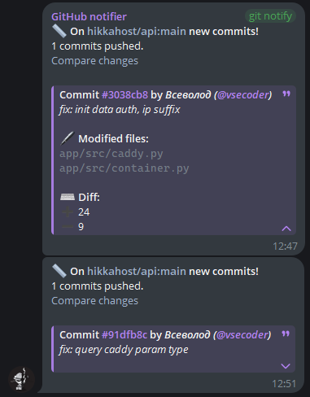
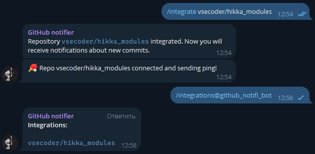

# github-notifi-bot

## Description

This is a simple bot that will notify you when a new issue, commits, stars, etc. are made on a repository. It is written in Python and uses the Github API.

Based on webhooks logic.

## Screenshots

Action messages example

---

List of repositories integrated with the bot in chat

## TODO

- [ ] Add more actions (e.g. issue comments, etc.)
- [x] Add chat events settings (e.g. enable/disable events)
- [ ] Add stats admin command
- [ ] **Filters** — per-chat ignore rules: author (e.g. `dependabot`), branch, label, event subtype
- [ ] **AI summary for large PRs / commits** — client provides API key, model name and provider
      (Anthropic / OpenAI / OpenRouter / etc.); diff + commit titles are sent to the model and the
      generated TL;DR is appended to the notification
- [ ] `/test <repo>` command — send a synthetic webhook payload to verify delivery without pushing
- [ ] `/status` command — per-integration health: `last_event_at`, `events_24h`, healthy/unhealthy
- [ ] **Custom message templates** (Jinja-style) — each chat can override the message format per event
- [ ] **Localization** (en / ru, extensible)
- [ ] **Webhook secret + HMAC verification** (`X-Hub-Signature-256`) — reject forged events
- [ ] **Encrypt GitHub tokens at rest** in the database (Fernet/AES, key from env)
- [ ] **Org mode** — `/integrate myorg/*` to subscribe to all repositories of an organization at once
- [ ] **Stats** — `/stats <period>`: top authors, top repos by activity, ASCII activity graph
- [ ] **Auto-pin important releases** — by label (e.g. `major`) or by semver major bump
- [ ] `/whoami` (DM) — show all repositories and chats the user is subscribed to
- [ ] `/mute <duration>` — temporarily silence notifications in a chat (e.g. `/mute 2h`)
- [ ] **Emoji reactions** on bot messages map to GitHub actions (👍 → approve PR,
      👎 → request changes, 🔁 → re-run failed CI, etc.)
- [ ] **Render GitHub Markdown** in PR / issue bodies as Telegram HTML (headings, lists, links,
      code blocks) instead of raw escaped text